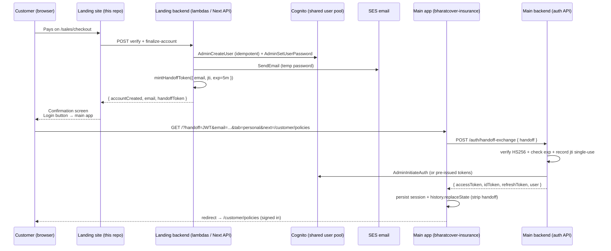

# Post-Payment Personal Login Handoff

The landing site (`bharatcover-landing`) and the main BharatCover app
(`bharatcover-insurance.vercel.app`) share the same AWS Cognito User Pool
(`us-east-1_4tb0R1s0t`) and DynamoDB tables. After a customer pays for a
policy on the landing site we provision their Cognito account here and hand
them off to the main app's Personal/Organisation login.

This document describes the contract between the two apps so the main app
team can wire up the receiving side independently.

## Goals

1. Customer pays on `bharatcover-landing.vercel.app`.
2. Landing site:
   - generates a temporary password,
   - creates the Cognito user (idempotent) in the shared User Pool,
   - emails the credentials,
   - mints a single-use handoff JWT,
   - redirects the browser to the main app login URL.
3. Main app either auto-signs the customer in (Mode A) or shows the
   Personal login tab with the email prefilled (Mode B fallback). The user
   then types the emailed password.

The customer's password is never placed in any URL, log, analytics event,
or browser history.

## Sequence



## Redirect URL

```
https://bharatcover-insurance.vercel.app/?handoff=<jwt>&email=<urlencoded>&tab=personal&next=/customer/policies
```

| Param     | Required | Notes                                                                 |
|-----------|----------|-----------------------------------------------------------------------|
| `handoff` | Mode A   | Single-use JWT (HS256, 5 min). Absent if landing has no signing key.  |
| `email`   | Always   | Lowercased. Used to prefill Personal login if `handoff` is missing/expired. |
| `tab`     | Always   | `personal` — forces the Personal login tab on the main app.           |
| `next`    | Always   | Path inside the main app to navigate after sign-in.                   |

## Handoff JWT contract

- **Algorithm:** HS256.
- **Secret:** `HANDOFF_JWT_SECRET` — identical on both sides. 32+ random bytes.
- **Lifetime:** 5 minutes.
- **Payload:**
  ```json
  {
    "email": "alice@example.com",
    "jti": "550e8400-e29b-41d4-a716-446655440000",
    "iat": 1714200000,
    "exp": 1714200300
  }
  ```
- **Single-use:** the main app records `jti` in a TTL-backed table on first
  redemption and refuses subsequent uses.

The signing helper is `backend/shared/auth/handoff-jwt.ts` (lambdas) and
`frontend/lib/handoff-jwt.ts` (Next.js routes). Both files have the same
payload shape and algorithm so either side can mint or verify without
deviating.

## What this repo does

| File | Role |
|------|------|
| `backend/shared/auth/customer-self-registration.ts` | Generates temp password, writes DynamoDB row, **idempotently provisions Cognito** (`AdminCreateUser` + `AdminSetUserPassword`). |
| `backend/lambdas/sales/finalize-sales-customer-account.ts` | After `verify-sales-policy-payment`, mints handoff JWT and returns it alongside `accountCreated`. |
| `backend/cdk/lib/stacks/sales-public-api-stack.ts` | Injects `USER_POOL_ID`, `CLIENT_ID`, `HANDOFF_JWT_SECRET`, `POLICY_EMAIL_FROM` and grants Cognito + SES IAM to the finalize lambda. |
| `frontend/app/api/checkout/complete/route.ts` | Direct-Razorpay path: provisions Cognito + mints handoff JWT before responding. |
| `frontend/lib/main-app-handoff.ts` | Builds the redirect URL with `handoff`, `email`, `tab`, `next`. |
| `frontend/lib/handoff-jwt.ts` | HS256 signing/verification helper. |
| `frontend/app/sales/checkout/page.tsx` | "Login to Policy Portal" + "Policy login" buttons now redirect to the main app. |

## What the main app must implement

1. **`POST /auth/handoff-exchange`** (no Cognito authorizer)
   - Body: `{ "handoff": "<jwt>" }`.
   - Verify HS256 with `HANDOFF_JWT_SECRET`.
   - Reject if `exp` past, payload malformed, or `jti` already redeemed.
   - On first valid redemption, record `jti` in a TTL'd DynamoDB row
     (suggested: `HANDOFF_TOKENS#<jti>` with TTL = `exp + 60s`).
   - Use `AdminInitiateAuth` or a pre-issued token strategy to return
     `{ accessToken, idToken, refreshToken, user }`.

2. **`/` (Personal/Organisation login page)**
   - On mount, parse `handoff`, `email`, `tab`, `next` from
     `window.location.search`.
   - If `handoff` is present:
     - `POST /auth/handoff-exchange`,
     - on success persist tokens via the existing auth-storage util,
     - `router.replace(next || '/customer/policies')`,
     - **always** strip `handoff` from the URL via `history.replaceState`
       so it isn't bookmarked / shared.
   - If `handoff` is missing, expired, or used:
     - prefill the Personal login form with `email` and force the
       Personal tab if `tab=personal`.
     - Customer signs in manually with the emailed password.

3. **CDK / API Gateway:** wire `POST /auth/handoff-exchange` into the
   existing auth API Gateway with the `HANDOFF_JWT_SECRET` env var injected
   into the lambda. No Cognito authorizer on this route.

4. **Optional client helper:** `lib/auth.ts → exchangeHandoffToken(token)`.

## Local testing

1. Set `HANDOFF_JWT_SECRET` to the same value in both `frontend/.env`
   (server-only, do **not** prefix with `NEXT_PUBLIC_`) and the main app's
   server env.
2. Set `NEXT_PUBLIC_MAIN_APP_URL=http://localhost:3000` in
   `frontend/.env.local` and run the main app on port 3000.
3. Run the landing site (`npm run dev` in `frontend/`, port 4000) and pay
   through `/sales/checkout`.
4. Click **Login to Policy Portal** on the confirmation screen.
5. Verify:
   - Browser navigates to
     `http://localhost:3000/?handoff=...&email=...&tab=personal&next=/customer/policies`.
   - Main app exchanges the JWT and lands on `/customer/policies` signed in.
   - Reloading the original handoff URL fails (single-use).
   - If `HANDOFF_JWT_SECRET` is wrong, main app falls back to email-prefill
     and manual sign-in still works.

## Acceptance checklist

- [ ] New customer pays → automatically signed in on `/customer/policies`.
- [ ] Existing customer re-paying → fresh `jti` issued, flow works again.
- [ ] Expired `handoff` → main app shows Personal login with email prefilled.
- [ ] Same `handoff` URL opened twice → second attempt rejected (single-use).
- [ ] Password never appears in URL, query, fragment, header, log, or analytics event.
- [ ] HTTPS only in production.

## Security notes

- `HANDOFF_JWT_SECRET` is a server-only environment variable. Never expose
  it to the browser, never commit it, never include it in any
  `NEXT_PUBLIC_*` variable.
- Generated temp passwords live only in:
  - the SES email body,
  - the in-memory response of `/api/checkout/complete` to the
    confirmation screen (direct Razorpay dev path).
  They are never stored in plaintext in DynamoDB or MongoDB (only hashed).
- The `email_verified=true` attribute is set on `AdminCreateUser` because
  the customer's email was confirmed during checkout. If you tighten that
  later (e.g. require explicit verification) update both ends together.
